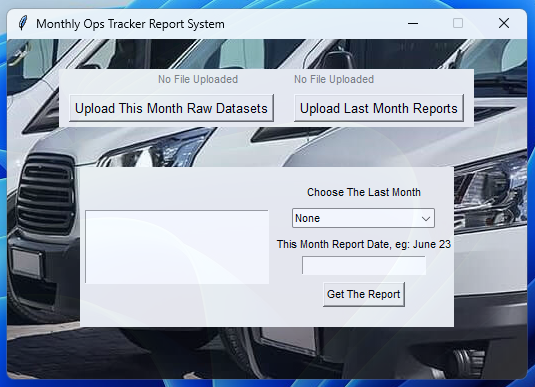
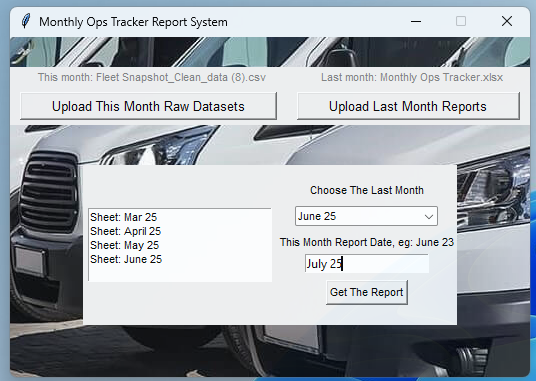

# NYC Fleet Report Automation System

An automated system for generating **monthly vehicle reports** for New York City government departments.

This system streamlines the data collection, processing, and reporting workflow, significantly reducing manual workload and minimizing human errors.  
It has been **officially deployed and in use since [Month Year]**.

---

## Features

- Automatically collects and cleans vehicle operation data.
- Generates standardized monthly fleet reports.
- Reduces manual work by over 90%.
- Ensures accurate and timely reporting.
- User-friendly command-line interface.

---

## Screenshots

Below are example screenshots of the system in use:

### Main Interface
- The main interface of the system, where users can start and monitor the report generation process.



### Operation Interface
- The operation interface showing the detailed commands and real-time feedback.



---

## Deployment

The system has been deployed within one of the NYC government departments and is used monthly to generate official fleet operation reports.

---

## Getting Started

Clone the repository:
```bash
git clone https://github.com/WineGorilla/NYC-Official-Monthly-Fleet-Report-System.git
